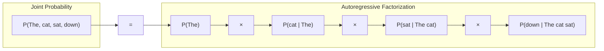
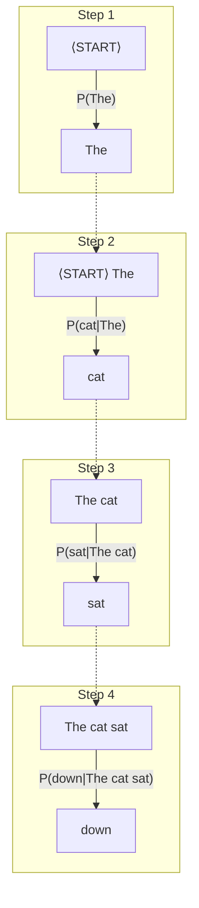

# Section 1.1: Probability Foundations

*Reading time: 15 minutes | Difficulty: ★★☆☆☆*

Before we can build a language model, we need to understand probability. Not just use it—*understand* it. This section builds the foundation everything else rests on.

## What is Probability?

Probability is a way of quantifying uncertainty. When we say "the probability of rain tomorrow is 70%," we're expressing our degree of belief that it will rain.

But what does that number actually *mean*? There are two main interpretations:

**Frequentist interpretation**: If we could repeat tomorrow infinitely many times, it would rain in 70% of those tomorrows. Probability is the long-run frequency of an event.

**Bayesian interpretation**: Probability represents our degree of belief. The 70% encodes our uncertainty given our current knowledge.

For language modeling, we'll mostly use the frequentist view: if we sample many sentences from English, what fraction start with "The"? That fraction is approximately P("The" is the first word).

## Mathematical Notation

Before proceeding, let's establish the mathematical notation we'll use throughout this book:

**Set notation**:

- **{a, b, c}**: A set containing elements a, b, and c (curly braces denote sets)
- **∈**: "Element of" — x ∈ S means "x is in set S"
- **∩**: Intersection — A ∩ B means "elements in both A and B"
- **∪**: Union — A ∪ B means "elements in A or B (or both)"
- **∅**: The empty set — a set with no elements

**Summation and product notation**:

- **Σ (sigma)**: Summation — $\sum_{i=1}^{n} x_i$ means $x_1 + x_2 + \cdots + x_n$
- **∏ (capital pi)**: Product — $\prod_{i=1}^{n} x_i$ means $x_1 \times x_2 \times \cdots \times x_n$

**Probability notation**:

- **P(A)**: Probability of event A occurring
- **P(A|B)**: Conditional probability — probability of A given that B occurred (defined formally below)
- **P(A, B)**: Joint probability — equivalent to P(A ∩ B), the probability of both A and B
- **X ~ P**: "X is distributed as P" — random variable X follows distribution P

**Other notation**:

- **∀**: "For all"
- **∃**: "There exists"
- **ℝ**: The set of real numbers
- **■** or **□**: End of proof (also written Q.E.D.)

## Key Terminology

Before diving into the axioms, let's define our terms:

**Sample space (Ω)**: The set of all possible outcomes of a random process.
- Example: For a coin flip, Ω = {heads, tails}
- Example: For a die roll, Ω = {1, 2, 3, 4, 5, 6}

**Event**: Any subset of the sample space—a collection of outcomes we're interested in.
- Example: "Rolling an even number" is the event {2, 4, 6}

**Mutually exclusive events**: Events that cannot both occur. If A happens, B cannot happen, and vice versa.
- Example: "Rolling a 1" and "rolling a 6" are mutually exclusive
- Formally: A and B are mutually exclusive if A ∩ B = ∅ (their intersection is empty)

**Independent events**: Events where knowing one occurred doesn't change the probability of the other.
- Example: Two separate coin flips are independent
- Formally: A and B are independent if P(A|B) = P(A) and P(B|A) = P(B)
- Equivalently: P(A ∩ B) = P(A) · P(B)

## The Three Axioms of Probability

All of probability theory follows from just three axioms, formulated by Kolmogorov in 1933:

**Axiom 1 (Non-negativity)**: For any event A, P(A) ≥ 0

Probabilities can't be negative. You can't have a -30% chance of something.

**Axiom 2 (Normalization)**: P(Ω) = 1, where Ω is the entire sample space

Something must happen. The probability of *some* outcome occurring is 1.

**Axiom 3 (Additivity)**: For mutually exclusive events A and B,

$$P(A \cup B) = P(A) + P(B)$$

If A and B can't both happen, the probability of either happening is the sum.

From these three axioms, we can derive everything else. For example:

**P(not A) = 1 - P(A)**:
Since A and "not A" are mutually exclusive and exhaust all possibilities:

$$P(A) + P(\text{not } A) = P(\Omega) = 1$$

## Conditional Probability

Here's where things get interesting. Often we want to know the probability of an event *given that we already know something*.

**Definition**: The conditional probability of A given B is:

$$P(A|B) = \frac{P(A \cap B)}{P(B)}$$

where P(B) > 0.

**What this means**: We're restricting our attention to only the cases where B happens, and asking what fraction of those cases also have A happening.

**Example**:

- Let A = "the word is 'cat'"
- Let B = "the previous word is 'the'"
- P(A|B) = P("the cat") / P("the ...") = (frequency of "the cat") / (frequency of "the" followed by anything)

This is *exactly* what we need for language modeling.

## Deriving the Chain Rule

The chain rule is the mathematical foundation of autoregressive language models. Let's derive it carefully.

### Two Events

Starting from the definition of conditional probability:

$$P(A|B) = \frac{P(A \cap B)}{P(B)}$$

Rearranging:

$$P(A \cap B) = P(A|B) \cdot P(B)$$

This is the **product rule**: the probability of both A and B equals the probability of B times the probability of A given B.

We could also write it the other way:

$$P(A \cap B) = P(B|A) \cdot P(A)$$

Both are correct. The choice depends on what we know.

### Three Events

Now let's extend to three events. We want P(A ∩ B ∩ C).

First, treat (A ∩ B) as a single event and apply the product rule:

$$P(A \cap B \cap C) = P(C | A \cap B) \cdot P(A \cap B)$$

Now expand P(A ∩ B):

$$P(A \cap B \cap C) = P(C | A \cap B) \cdot P(B | A) \cdot P(A)$$

Rewriting in a more suggestive order:

$$P(A, B, C) = P(A) \cdot P(B | A) \cdot P(C | A, B)$$

### The General Chain Rule

For n events, we apply the same logic inductively:

$$P(X_1, X_2, \ldots, X_n) = P(X_1) \cdot P(X_2|X_1) \cdot P(X_3|X_1,X_2) \cdots P(X_n|X_1,\ldots,X_{n-1})$$

Or more compactly:

$$P(X_1, \ldots, X_n) = \prod_{i=1}^{n} P(X_i | X_1, \ldots, X_{i-1})$$

**Proof by induction**:

*Base case*: For n=1, P(X₁) = P(X₁). ✓

*Inductive step*: Assume true for n-1. Then:

$$P(X_1, \ldots, X_n) = P(X_n | X_1, \ldots, X_{n-1}) \cdot P(X_1, \ldots, X_{n-1})$$

By inductive hypothesis:

$$= P(X_n | X_1, \ldots, X_{n-1}) \cdot \prod_{i=1}^{n-1} P(X_i | X_1, \ldots, X_{i-1})$$

$$= \prod_{i=1}^{n} P(X_i | X_1, \ldots, X_{i-1}) \quad \blacksquare$$

**This is not an approximation**. The chain rule is an exact mathematical identity. It follows directly from the definition of conditional probability.

## Why the Chain Rule Matters for Language

Consider a sentence as a sequence of words: "The cat sat down"

The probability of this sentence is:

$$P(\text{"The cat sat down"}) = P(\text{The}, \text{cat}, \text{sat}, \text{down})$$

By the chain rule:

$$= P(\text{The}) \cdot P(\text{cat}|\text{The}) \cdot P(\text{sat}|\text{The cat}) \cdot P(\text{down}|\text{The cat sat})$$

The following diagram visualizes this decomposition:

Each factor predicts the next word given all preceding words—this is the **autoregressive** pattern:

We've converted the problem of assigning probability to an entire sentence into a sequence of next-word predictions. This is the **autoregressive factorization**.

The term "autoregressive" means the model predicts each element based on previous elements—it regresses on its own past outputs.

!!! info "Connection to Modern LLMs"

    GPT-4, Claude, LLaMA, and every other modern language model uses exactly this autoregressive factorization. When you chat with ChatGPT, it's computing:

    P(response) = P(word₁) × P(word₂|word₁) × P(word₃|word₁,word₂) × ...

    The mathematics is identical to what we derived here. The only difference is *how* each conditional probability P(next|context) is computed—Markov models use counting, transformers use neural networks.

!!! note "Historical Note: Kolmogorov and the Axioms (1933)"

    The three axioms of probability were formalized by Andrey Kolmogorov in his 1933 monograph "Foundations of the Theory of Probability." Before Kolmogorov, probability was often treated intuitively without rigorous foundations.

    Kolmogorov's axioms unified different approaches (frequentist, Bayesian) under a single mathematical framework. The chain rule we derived follows directly from these axioms—it's not an approximation or heuristic, but a mathematical identity.

!!! warning "Common Mistake: Confusing Independence and Mutual Exclusivity"

    These are often confused:

    - **Mutually exclusive**: A and B cannot both happen. P(A ∩ B) = 0.
    - **Independent**: Knowing A doesn't change probability of B. P(A|B) = P(A).

    If A and B are mutually exclusive and both have non-zero probability, they are **not** independent! Knowing A happened tells you B definitely didn't.

## Summary

| Concept | Definition | Why It Matters |
|---------|------------|----------------|
| Probability | Quantified uncertainty | Foundation of everything |
| Conditional probability | P(A\|B) = P(A∩B)/P(B) | How we model "given context" |
| Chain rule | P(X₁...Xₙ) = ∏P(Xᵢ\|X₁...Xᵢ₋₁) | Enables autoregressive modeling |

We've now established the mathematical foundation. Next, we'll use these tools to define what a language model actually is.
