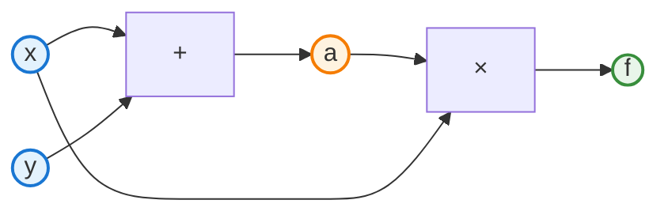
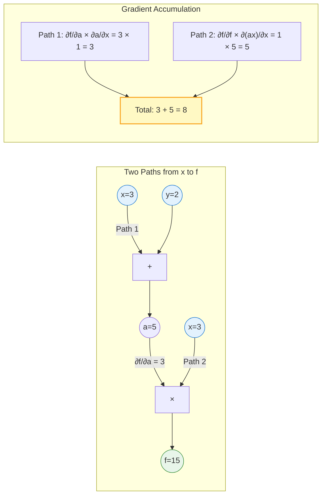

# Section 2.4: Computational Graphs

The chain rule tells us *how* to compute derivatives of compositions. But for complex expressions with many operations, we need a systematic way to *represent* the computation and apply the chain rule.

**Computational graphs** provide this representation. They're the key data structure that makes automatic differentiation possible.

## What is a Computational Graph?

A **computational graph** is a directed acyclic graph (DAG) that represents a mathematical expression:

- **Nodes** represent values (inputs, intermediate results, outputs)
- **Edges** represent dependencies (which values are used to compute which)
- **Operations** are associated with nodes (what function produced this value)

### Example: f(x, y) = (x + y) · x

Let's trace through this computation:

1. Start with inputs: x, y
2. Compute a = x + y
3. Compute f = a · x

The graph:



Reading the graph:

- x and y are inputs (no incoming edges)
- a depends on x and y via addition
- f depends on a and x via multiplication
- f is the output

Note that **x appears twice** in the graph—once feeding into the addition and once feeding directly into the multiplication. This is how DAGs represent shared variables.

### Terminology

| Term | Meaning |
|------|---------|
| Leaf node | Input variable (no incoming edges) |
| Internal node | Intermediate computation |
| Root node | Final output |
| Parents of v | Nodes that v directly depends on |
| Children of v | Nodes that directly depend on v |

## Building a Computational Graph

Any expression can be decomposed into primitive operations, each becoming a node.

### Example: f(x) = sin(x²) + x

Decomposition:

1. a = x²
2. b = sin(a)
3. f = b + x

Graph:
```
       x ─────┬──────────────┐
              │              │
              ▼              │
            [x²] ──▶ a       │
              │              │
              ▼              │
           [sin] ──▶ b       │
              │              │
              ▼              ▼
             [+] ──────────▶ f
```

### Example: Neural Network Layer

A typical layer computes: y = σ(Wx + b)

Decomposition:

1. a = W × x (matrix multiply)
2. c = a + b (add bias)
3. y = σ(c) (activation)

Each of these becomes a node in the graph.

## The Forward Pass

**Forward pass** (or forward propagation): Evaluate the graph from inputs to outputs.

Algorithm:

1. Assign values to input nodes
2. Process nodes in **topological order** (parents before children)
3. At each node, apply its operation to parent values

### Example Forward Pass

For f(x, y) = (x + y) · x with x = 3, y = 2:

| Step | Node | Operation | Value |
|------|------|-----------|-------|
| 1 | x | input | 3 |
| 2 | y | input | 2 |
| 3 | a | x + y | 5 |
| 4 | f | a × x | 15 |

Result: f(3, 2) = 15

### Topological Order

A topological order ensures we process each node only after all its parents.

For a DAG, this is always possible. We can use:

- **Kahn's algorithm**: Repeatedly remove nodes with no incoming edges
- **DFS**: Post-order traversal gives reverse topological order

## The Backward Pass

**Backward pass** (or backpropagation): Compute gradients from outputs to inputs.

This is where the chain rule comes in. For each node v:

$$\frac{\partial f}{\partial v} = \sum_{c \in \text{children}(v)} \frac{\partial f}{\partial c} \cdot \frac{\partial c}{\partial v}$$


We sum over all paths from v to the output f.

### Algorithm

1. Set ∂f/∂f = 1 (gradient of output with respect to itself)
2. Process nodes in **reverse topological order** (children before parents)
3. At each node v:
   - For each parent p of v:
   - Add (∂f/∂v) × (∂v/∂p) to ∂f/∂p

### Example Backward Pass

For f(x, y) = (x + y) · x, compute ∂f/∂x and ∂f/∂y.

First, the forward pass gave us: a = 5, f = 15

Now backward:

| Step | Node | Gradient | Computation |
|------|------|----------|-------------|
| 1 | f | ∂f/∂f = 1 | (start) |
| 2 | a | ∂f/∂a = x = 3 | ∂(a·x)/∂a = x |
| 3 | x | ∂f/∂x = ? | Via a: ∂f/∂a · ∂a/∂x = 3 · 1 = 3 |
|   |   |   | Via multiplication: ∂f/∂f · ∂(a·x)/∂x = 1 · a = 5 |
|   |   | Total: 3 + 5 = 8 | (sum paths) |
| 4 | y | ∂f/∂y = 3 | ∂f/∂a · ∂a/∂y = 3 · 1 = 3 |

**Verification**: f(x, y) = (x + y) · x = x² + xy

∂f/∂x = 2x + y = 2(3) + 2 = 8 ✓
∂f/∂y = x = 3 ✓

### Key Insight: Summing Paths

When a node contributes to the output through multiple paths, we **sum** the gradients from each path.

In the example, x contributes to f two ways:

1. Through a (as part of x + y): contributes gradient 3
2. Directly (as the second operand of multiplication): contributes gradient 5
3. Total: 8



This is the multivariate chain rule in action.

## Storing Information for the Backward Pass

During the forward pass, we need to store information for the backward pass:

1. **Graph structure**: Which nodes depend on which
2. **Intermediate values**: Some derivatives need forward pass values
3. **Gradients**: Accumulated during the backward pass

### Example: Multiplication Requires Cached Values

For z = x · y:

- ∂z/∂x = y (need the value of y)
- ∂z/∂y = x (need the value of x)

So the multiplication node must cache x and y during the forward pass.

### Example: Addition Doesn't Need Values

For z = x + y:

- ∂z/∂x = 1
- ∂z/∂y = 1

These are constants—no need to cache x or y.

## Local Gradients

Each operation has a **local gradient**: the derivative of its output with respect to each input.

| Operation | z = | ∂z/∂x | ∂z/∂y | Notes |
|-----------|-----|-------|-------|-------|
| Add | x + y | 1 | 1 | Constant |
| Subtract | x - y | 1 | -1 | Constant |
| Multiply | x · y | y | x | Need cached values |
| Divide | x / y | 1/y | -x/y² | Need cached values |
| Power | $x^n$ | n·$x^{n-1}$ | - | Need cached value |
| Exp | $e^x$ | $e^x$ | - | Can use output z |
| Log | ln(x) | 1/x | - | Need cached value |
| Sin | sin(x) | cos(x) | - | Need cached value |
| ReLU | max(0,x) | 1 if x>0, else 0 | - | Need sign of x |

**Note**: For exp, we can use the output: ∂($e^x$)/∂x = $e^x$ = z. This saves memory.

## A Complete Walkthrough

Let's trace f(x) = sin(x²) for x = √(π/2).

### Forward Pass

| Node | Expression | Value |
|------|------------|-------|
| x | input | √(π/2) ≈ 1.253 |
| a | x² | π/2 ≈ 1.571 |
| f | sin(a) | sin(π/2) = 1 |

### Backward Pass

Start with ∂f/∂f = 1.

| Node | Local gradient | Chain rule | Gradient |
|------|---------------|------------|----------|
| a | ∂(sin a)/∂a = cos(a) | 1 · cos(π/2) | 0 |
| x | ∂(x²)/∂x = 2x | 0 · 2(1.253) | 0 |

So ∂f/∂x = 0 at x = √(π/2).

**Check**: f(x) = sin(x²), so f'(x) = cos(x²) · 2x.
At x = √(π/2): f'(x) = cos(π/2) · 2√(π/2) = 0 · 2.51 = 0 ✓

## Graph Representation in Code

How do we represent a computational graph in code?

### The Node Class (Conceptual)

```python
class Node:
    def __init__(self, value, parents=None, operation=None):
        self.value = value           # Forward pass result
        self.grad = 0.0              # Accumulated gradient
        self.parents = parents or [] # Input nodes
        self.operation = operation   # How this node was computed
```

### Recording the Graph

When we compute z = x * y:
```python
z = Node(
    value=x.value * y.value,
    parents=[x, y],
    operation='mul'
)
```

### The Backward Function

```python
def backward(node):
    # Topological sort in reverse
    topo_order = reverse_topological_sort(node)

    node.grad = 1.0  # df/df = 1

    for n in topo_order:
        for parent, local_grad in n.get_local_gradients():
            parent.grad += n.grad * local_grad
```

We'll implement this fully in Section 2.6.

## Why DAGs? Why Not Trees?

Some expressions share subexpressions:

f(x) = x² + sin(x²)

The term x² appears twice. With a tree, we'd compute it twice. With a DAG, we compute it once and reuse.

In neural networks, weight matrices are used in the forward pass and needed in the backward pass. DAGs naturally handle this sharing.

## Summary

| Concept | Description |
|---------|-------------|
| Computational graph | DAG representing computation |
| Forward pass | Evaluate graph, cache intermediates |
| Backward pass | Apply chain rule in reverse order |
| Local gradient | ∂(output)/∂(input) for one operation |
| Gradient accumulation | Sum gradients from multiple paths |

**Key insight**: The computational graph makes the chain rule mechanical. Given local gradients for each primitive operation, we can differentiate any composition automatically.

## Exercises

1. **Draw the graph**: For f(x) = (x - 1)(x + 1), draw the computational graph and verify ∂f/∂x by the backward pass.

2. **Multiple uses**: For f(x) = x · x, draw the graph. Why is ∂f/∂x = 2x (not x)?

3. **Three variables**: For f(x,y,z) = (x + y) · z, compute all three partial derivatives using backward pass.

4. **Graph for neural layer**: Draw the computational graph for y = relu(w·x + b) where relu(t) = max(0, t).

5. **Memory analysis**: Which operations need to cache their inputs? Which can compute local gradients from their output?

## What's Next

We've seen how to represent computation as a graph and apply the chain rule systematically. But there are two fundamentally different ways to traverse the graph:

- **Forward mode**: Compute ∂(everything)/∂(one input)
- **Reverse mode**: Compute ∂(one output)/∂(everything)

For machine learning, reverse mode is dramatically more efficient. Section 2.5 explains why.
